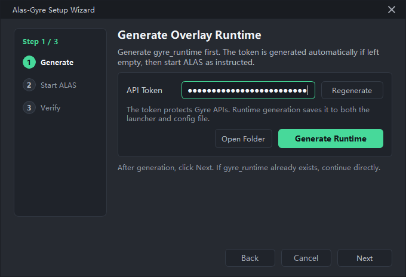
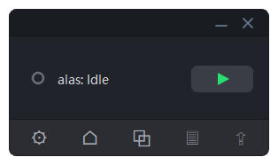
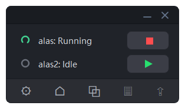
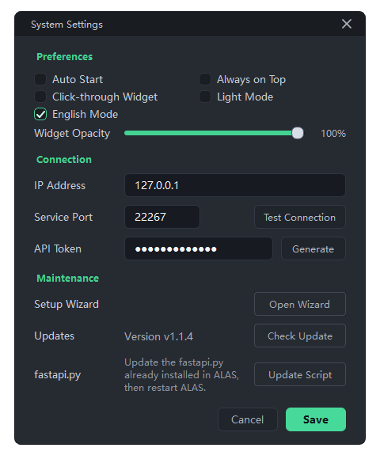
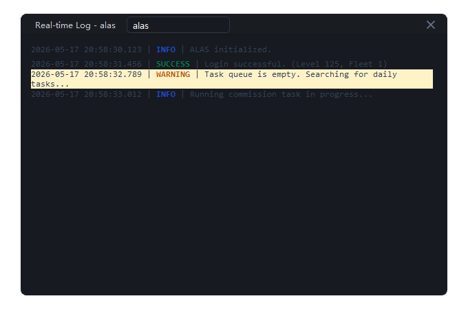
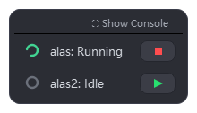

# Alas-Gyre

**A lightweight desktop control plane for AzurLaneAutoScript.**

Alas-Gyre gives ALAS users a cleaner way to operate daily automation: generate an external Overlay Runtime, start ALAS through the Gyre launcher, then manage configs, status, logs, screenshots, and runtime updates from one desktop client.

[简体中文](README.zh-cn.md)

---

## Preview

### Setup Wizard

### Console

### Multi-config Control

### Settings

### Logs

### Floating Monitor

## What is Alas-Gyre?

Alas-Gyre is a desktop client for users who already run ALAS. It does not replace official ALAS source files. Instead, it creates a portable `gyre_runtime` directory and uses a launcher to load an Overlay Runtime when ALAS starts.

The result is a small operational layer for day-to-day control: start or stop configs, watch status, open logs, inspect error screenshots, and update the Overlay Runtime without manually editing the ALAS installation.

## Features

- **Overlay Runtime** - integrates with ALAS at launch time while keeping official ALAS files untouched.
- **Remote control** - operate ALAS running on another Windows or Linux machine from the desktop client.
- **Multi-config dashboard** - monitor multiple ALAS configs and control each one independently.
- **Task visibility** - optional **Show Task Name** mode with ALAS task-name translation and scrolling long labels.
- **Logs and screenshots** - open recent logs and error screenshots from the same client.
- **Floating monitor** - compact always-on-top view with opacity and click-through options.
- **Runtime updater** - update launcher and overlay files after the first deployment through the updater service.
- **Stable desktop UI** - dark/light themes, tray integration, always-on-top mode, and startup wizard.

## Platform Support

| Component | Windows | macOS | Linux |
| --- | --- | --- | --- |
| Alas-Gyre desktop client | Release executable or source | Source run | Source run |
| ALAS host launcher | `start_gyre_alas.bat` | Not targeted | `start_gyre_alas.sh` |
| Runtime updater service | Supported | Not targeted | Supported |

macOS/Linux desktop usage means running the client from source with Python and PySide6. Packaged desktop releases are currently focused on Windows.

## Quick Start

### 1. Generate `gyre_runtime`

Open Alas-Gyre and follow the setup wizard. The wizard generates `gyre_runtime`; the connection test is optional and can be done after ALAS is started with the launcher.

### 2. Place Runtime outside ALAS

Copy `gyre_runtime` to the machine that runs ALAS. Keep it outside the official ALAS directory so ALAS updates do not remove the runtime.

### 3. Start ALAS through the Gyre launcher

Windows host:

~~~bat
start_gyre_alas.bat
~~~

Linux host:

~~~bash
chmod +x start_gyre_alas.sh
./start_gyre_alas.sh
~~~

Use the launcher menu to select the ALAS root, then start ALAS in foreground or background mode.

### 4. Connect from the desktop client

Return to Alas-Gyre, configure the host in Settings if needed, and run the optional connection test.

## Client Setup

### Windows client

Recommended: download the Windows release executable and run it directly.

Source run is also supported:

~~~powershell
python -m venv .venv
.\.venv\Scripts\Activate.ps1
python -m pip install --upgrade pip
pip install -r requirements.txt
python main.py
~~~

### macOS client

Run from source:

~~~bash
python3 -m venv .venv
source .venv/bin/activate
python -m pip install --upgrade pip
pip install -r requirements.txt
python main.py
~~~

If Python is not available, install Python 3.10+ first. On Apple Silicon, use a native Python build when possible.

### Linux desktop client

Run from source:

~~~bash
python3 -m venv .venv
source .venv/bin/activate
python -m pip install --upgrade pip
pip install -r requirements.txt
python main.py
~~~

If Qt fails to start because the XCB platform plugin cannot load, install the missing desktop Qt/XCB runtime libraries for your distribution, then rerun the client.

## ALAS Host Setup

### Windows ALAS host

1. Copy `gyre_runtime` to a stable location outside the ALAS directory.
2. Run `start_gyre_alas.bat`.
3. Use the menu to select the ALAS root.
4. Start ALAS in foreground or background mode.
5. Keep using the Gyre launcher for future ALAS starts.

### Linux ALAS host

1. Upload `gyre_runtime` to a stable location outside the ALAS directory.
2. Run:

~~~bash
chmod +x start_gyre_alas.sh
./start_gyre_alas.sh
~~~

3. Use the terminal menu to select the ALAS root.
4. Start ALAS in foreground or background mode.
5. Use the launcher menu to view status, stop/restart ALAS, and manage the runtime updater service.

## Runtime Updates

After the first deployment, Alas-Gyre can update the remote Overlay Runtime from Settings.

- Default updater listen address: `0.0.0.0:22268` for LAN access
- Managed by the launcher menu: status, start, stop, restart
- Uses the same Gyre token generated by the setup wizard
- Sends only changed runtime files
- Takes effect after ALAS is restarted through the launcher
- LAN update access is enabled by default for devices that can reach the ALAS host.
- Do not expose the updater port to the public Internet.

## Development

Run from source:

~~~bash
python -m venv .venv
source .venv/bin/activate  # Windows: .venv\Scripts\Activate.ps1
python -m pip install --upgrade pip
pip install -r requirements.txt
python main.py
~~~

Build the Windows package:

~~~powershell
pip install -r requirements-dev.txt
python -m PyInstaller Alas-Gyre.spec --noconfirm
~~~

## Troubleshooting

### Overlay API is unavailable

Start ALAS through `start_gyre_alas.bat` or `start_gyre_alas.sh`, then run the connection test again.

### Token mismatch

Regenerate `gyre_runtime` or update the remote Runtime from Settings, then restart ALAS through the launcher so the desktop client and runtime use the same token.

### Runtime updater is unreachable

Open the launcher menu on the ALAS host and start or restart the updater service. Confirm that the LAN firewall allows the update port and that the token matches Settings.

### Linux GUI does not start

Install missing Qt/XCB runtime libraries for your distribution. This usually indicates the Python dependencies installed correctly, but the desktop environment lacks required Qt platform libraries.

### Task text is too noisy

Disable **Show Task Name** in Settings. Long config names still scroll automatically in the main and floating windows.

## License

Alas-Gyre is released under the [GNU General Public License v3.0](LICENSE).
