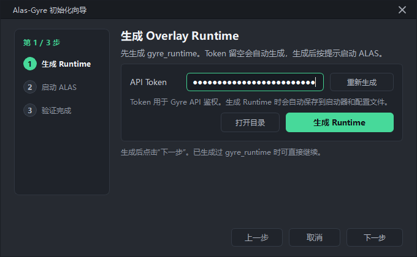
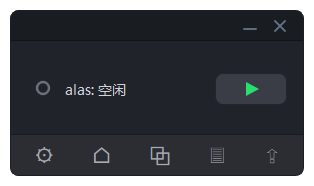
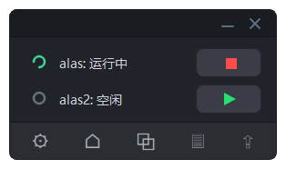
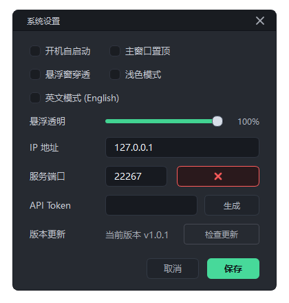
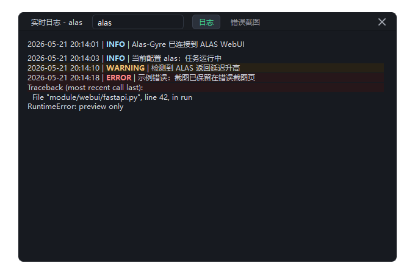
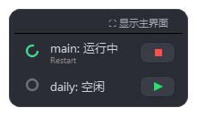

# Alas-Gyre

**面向 AzurLaneAutoScript 的轻量桌面控制台。**

Alas-Gyre 为 ALAS 用户提供更清晰的日常操作方式：生成独立的 Overlay Runtime，通过 Gyre 启动器启动 ALAS，然后在桌面客户端集中管理配置、状态、日志、截图和 Runtime 更新。

[English](README.md)

---

## 界面预览

### 初始化向导

### 主控制台

### 多配置控制

### 设置

### 日志

### 悬浮监控

## Alas-Gyre 是什么？

Alas-Gyre 是给 ALAS 用户使用的桌面客户端。它不会替换 ALAS 官方源码，而是生成一个可移动的 `gyre_runtime` 目录，并通过启动器在 ALAS 启动时加载 Overlay Runtime。

这样可以把日常控制能力放在 Alas-Gyre 管理的运行时中：启动或停止配置、查看状态、打开日志、查看错误截图，并在后续通过客户端更新 Overlay Runtime。

## 功能特性

- **Overlay Runtime**：在启动时接入 ALAS，不改动 ALAS 官方文件。
- **远程控制**：可以从桌面客户端控制 Windows 或 Linux 设备上的 ALAS。
- **多配置面板**：集中显示多个 ALAS 配置，并可分别启动、停止和查看状态。
- **任务可视化**：可选 **显示任务名称**，支持 ALAS 任务名翻译和长文本滚动。
- **日志与截图**：在同一个客户端中查看运行日志和错误截图。
- **悬浮监控**：提供紧凑悬浮窗，支持透明度和点击穿透选项。
- **Runtime 更新**：首次部署后可通过更新服务维护启动器和 Overlay 文件。
- **稳定桌面体验**：深色/浅色主题、托盘、置顶、初始化向导等常用功能。

## 平台支持

| 组件 | Windows | macOS | Linux |
| --- | --- | --- | --- |
| Alas-Gyre 桌面客户端 | Release exe 或源码运行 | 源码运行 | 源码运行 |
| ALAS 运行端启动器 | `start_gyre_alas.bat` | 暂不作为目标平台 | `start_gyre_alas.sh` |
| Runtime 更新服务 | 支持 | 暂不作为目标平台 | 支持 |

macOS/Linux 桌面客户端以 Python + PySide6 源码运行方式使用。当前正式打包发布主要面向 Windows。

## 快速开始

### 1. 生成 `gyre_runtime`

打开 Alas-Gyre，按照初始化向导生成 `gyre_runtime`。向导中的连接测试是可选验证，可以等 ALAS 通过启动器启动后再进行。

### 2. 将 Runtime 放在 ALAS 目录外

把 `gyre_runtime` 复制到运行 ALAS 的设备上。建议放在 ALAS 官方目录外，避免 ALAS 更新时被移除。

### 3. 通过 Gyre 启动器启动 ALAS

Windows 运行端：

~~~bat
start_gyre_alas.bat
~~~

Linux 运行端：

~~~bash
chmod +x start_gyre_alas.sh
./start_gyre_alas.sh
~~~

在启动器菜单中选择 ALAS 根目录，然后以前台或后台模式启动 ALAS。

### 4. 回到桌面客户端连接

返回 Alas-Gyre，根据需要在设置中填写主机信息，并执行可选连接测试。

## 客户端使用

### Windows 客户端

推荐直接下载 Windows release exe 运行。

也可以从源码运行：

~~~powershell
python -m venv .venv
.\.venv\Scripts\Activate.ps1
python -m pip install --upgrade pip
pip install -r requirements.txt
python main.py
~~~

### macOS 客户端

从源码运行：

~~~bash
python3 -m venv .venv
source .venv/bin/activate
python -m pip install --upgrade pip
pip install -r requirements.txt
python main.py
~~~

如果系统没有 Python，请先安装 Python 3.10+。Apple Silicon 设备建议使用原生架构的 Python。

### Linux 桌面客户端

从源码运行：

~~~bash
python3 -m venv .venv
source .venv/bin/activate
python -m pip install --upgrade pip
pip install -r requirements.txt
python main.py
~~~

如果 Qt 因 XCB platform plugin 无法启动，请为当前发行版安装缺失的桌面 Qt/XCB 运行库，然后重新运行客户端。

## ALAS 运行端设置

### Windows 运行端

1. 将 `gyre_runtime` 放到 ALAS 目录外的稳定位置。
2. 运行 `start_gyre_alas.bat`。
3. 在菜单中选择 ALAS 根目录。
4. 以前台或后台模式启动 ALAS。
5. 之后继续通过 Gyre 启动器启动 ALAS。

### Linux 运行端

1. 将 `gyre_runtime` 上传到 ALAS 目录外的稳定位置。
2. 执行：

~~~bash
chmod +x start_gyre_alas.sh
./start_gyre_alas.sh
~~~

3. 在终端菜单中选择 ALAS 根目录。
4. 以前台或后台模式启动 ALAS。
5. 通过启动器菜单查看状态、停止/重启 ALAS，并管理 Runtime 更新服务。

## Runtime 更新

首次部署完成后，可以在设置页更新远端 Overlay Runtime。

- 默认更新服务监听地址：`127.0.0.1:22268`
- 由启动器菜单管理：查看状态、启动、停止、重启
- 使用初始化向导生成的同一个 Gyre Token
- 只传输发生变化的 Runtime 文件
- 更新后通过启动器重启 ALAS 生效
- 远程更新需要主动修改启动器配置，例如在 `.gyre_runtime.conf` 中设置 `GYRE_UPDATE_HOST=0.0.0.0` 或可信内网 IP。
- 不建议把更新服务端口暴露到公网。

## 开发

从源码运行：

~~~bash
python -m venv .venv
source .venv/bin/activate  # Windows: .venv\Scripts\Activate.ps1
python -m pip install --upgrade pip
pip install -r requirements.txt
python main.py
~~~

构建 Windows 包：

~~~powershell
pip install -r requirements-dev.txt
python -m PyInstaller Alas-Gyre.spec --noconfirm
~~~

## 常见问题

### Overlay API 不可用

请通过 `start_gyre_alas.bat` 或 `start_gyre_alas.sh` 启动 ALAS，然后重新测试连接。

### Token 不一致

重新生成 `gyre_runtime`，或在设置中更新远端 Runtime，然后通过启动器重启 ALAS，确保桌面客户端和 Runtime 使用同一个 Token。

### Runtime 更新服务不可达

在 ALAS 所在设备上打开启动器菜单，启动或重启更新服务。更新服务默认只监听 `127.0.0.1`；如需远程更新，请将 `GYRE_UPDATE_HOST` 配置为可信内网地址，并确认端口和 Token 与设置页一致。

### Linux GUI 无法启动

安装当前发行版缺失的 Qt/XCB 运行库。这通常表示 Python 依赖已经安装，但桌面环境缺少 Qt 平台库。

### 任务名称显示过多

在设置中关闭 **显示任务名称**。主界面和悬浮窗仍会自动滚动过长的配置名。

## 许可证

Alas-Gyre 基于 [GNU General Public License v3.0](LICENSE) 发布。
